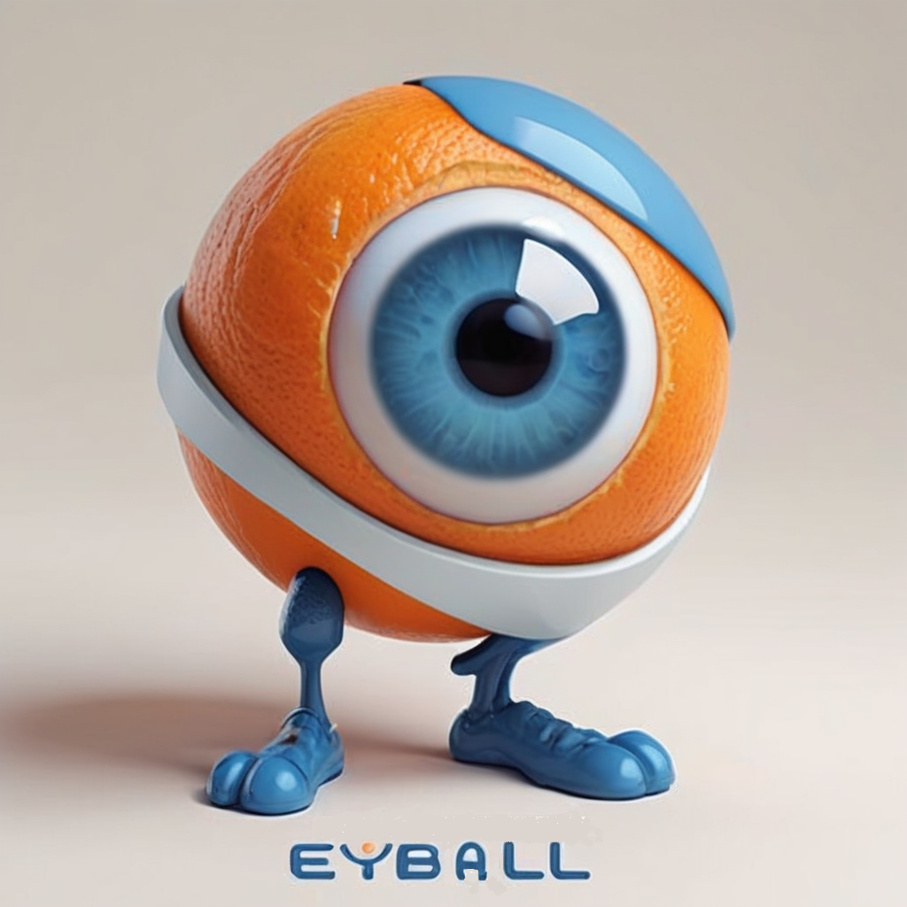

# Eyball
Anomaly detection engine

Implement a class to detect anomalies, using an AI model in images based which call be called from visual checking automation.

Date: 5/1/2024

Fulmine Labs LLC

## Overview
The challenge: 

## Datasources used

## Current Version
The current stable version of the project is 0.
See the [CHANGELOG.md](CHANGELOG.md) file for details about this version.

## Prerequisites

* Anaconda, with an environment having the Python libraries listed in [requirements.txt](requirements.txt)

## Usage

Install Anaconda, create an environment and install the dependencies in requirements.txt

## Testing

## Known issues

## Acknowledgements

This code was written collaboratively with [GPT-4V](https://chat.openai.com/). Thank you Assistant!

## License
MIT open source license

## Collaboration
We welcome contributions at all levels of experience, whether it's with code, documentation, tests, bug reports, feature requests, or other forms of feedback. If you're interested in helping improve this tool, here are some ways you can contribute:

Ideas for Improvements: Have an idea that could make the Fulmine Labs mini-PACS better? Open an issue with the tag enhancement to start a discussion about your idea.

Bug Reports: Notice something amiss? Submit a bug report under issues, and be sure to include as much detail as possible to help us understand the problem.

Feature Requests: If you have a suggestion for a new feature, describe it in an issue with the tag feature request.

Documentation: Good documentation is just as important as good code. Although this is currently a very simple tool, if you'd like to contribute documentation, we'd greatly appreciate it.

Code: If you're looking to update or write new code, check out the open issues and look for ones tagged with good first issue or help wanted.

## Contact
Duncan Henderson, Fulmine Labs LLC henderson.duncanj@gmail.com
